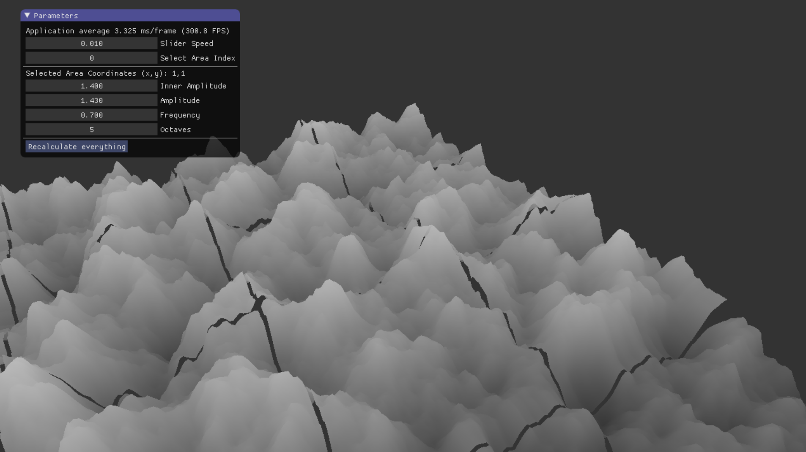
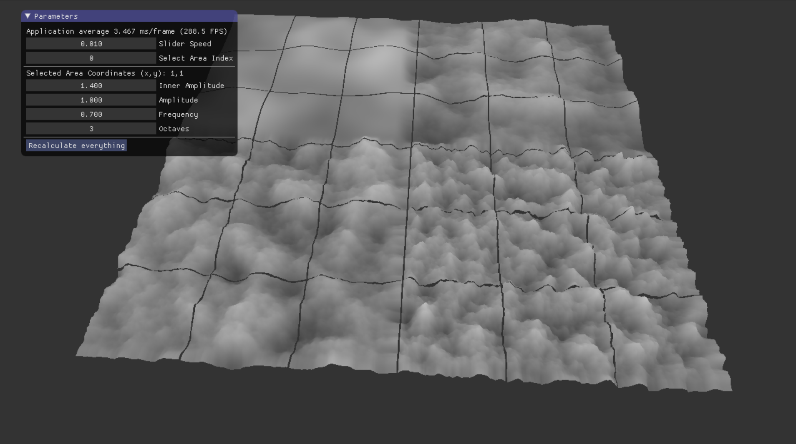

## leistungsnachweis-dingo

### Definition
Perlin Noise ist ein Algrorithmus der zur Erzeugung von zufällig, jedoch realistisch aussehendem Terrrain verwendet wird. Er basiert auf dem normalen Noise-Algorithmus und wurde 1982 von Ken Perlin entwickelt. Perlin Noise ist nicht nur performanter, als der normale Noise-Algorithmus, sondern schafft es auch noch realistisch wirkendere Terrains zu generieren. Ken Perlin wurde für die Entwicklung 1997 ein Oscar verliehen.

### Screenshots
#### Bild 1

#### Bild 2

### Documentation
[Documentation](https://ob-algdatii-ss18.github.io/leistungsnachweis-dingo/docs/html/files.html) (Only "Chunk", "Area" and "Perlin" matter. Rest is 3D rendering.)

### Externe Bibliotheken
imGui: https://github.com/ocornut/imgui  
SDL: https://www.libsdl.org/  
glew: http://glew.sourceforge.net/  
glm: https://glm.g-truc.net/0.9.9/index.html  

### Quellen und Links 
scratchpixel: http://www.scratchapixel.com/lessons/procedural-generation-virtual-worlds%20/perlin-noise-part-2?url=procedural-generation-virtual-worlds%20/perlin-noise-part-2  

adrians soapbox: http://flafla2.github.io/2014/08/09/perlinnoise.html
